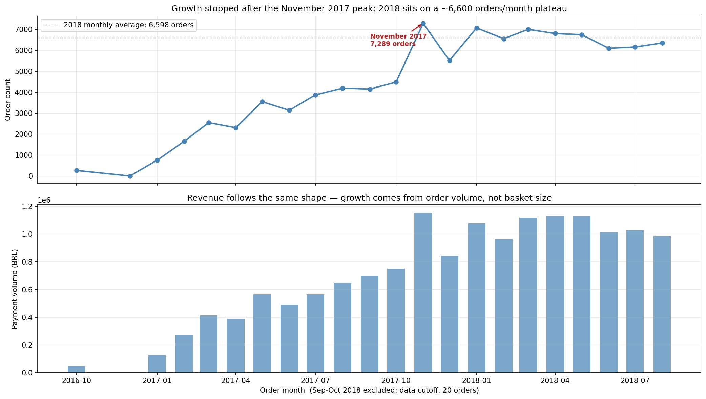
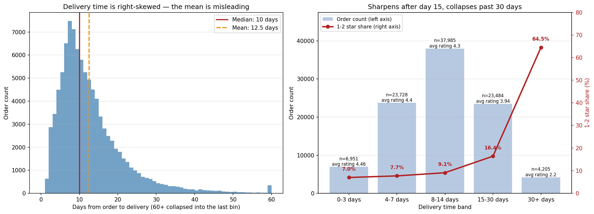

# Olist E-Commerce — SQL & Exploratory Data Analysis


> Turning 96,478 Brazilian marketplace orders into five business decisions — and auditing the analysis hard enough to find two of my own measurement errors.

An end-to-end SQL and EDA study of the [Olist](https://www.kaggle.com/datasets/olistbr/brazilian-ecommerce) e-commerce dataset (Oct 2016 – Aug 2018, 15.42M BRL in payments). Each of the five business questions is answered with a query, a chart, an explicit business recommendation, and a written limitations section. Two metric definitions were found to be wrong during a self-audit and corrected — the write-up documents both the error and its impact.

## Table of Contents

- [About](#about)
- [Key Findings](#key-findings)
- [Charts](#charts)
- [Method Notes](#method-notes)
- [Tech Stack](#tech-stack)
- [Project Structure](#project-structure)
- [Getting Started](#getting-started)
- [Usage](#usage)
- [Scope and Limitations](#scope-and-limitations)
- [License](#license)
- [Contributing](#contributing)
- [Author](#author)

## About

Olist is a Brazilian marketplace that connects small sellers to large e-commerce platforms. The public dataset covers roughly 100k orders with customers, sellers, items, payments, reviews and geolocation across nine tables.

The goal here was not to produce charts, but to reach conclusions a decision-maker could act on. That constraint drove three choices that shape the whole project:

1. **Every finding carries a limitations section.** If a number can't support a decision, the report says so rather than hiding it.
2. **Aggregates are opened up when they hide something.** Two headline metrics changed meaning once broken down one level further (monthly → daily, revenue → units/price/freight/rating).
3. **Definitions are audited, not assumed.** Two metrics — "late delivery" and "repeat customer" — were being measured incorrectly. Both were found, fixed, and documented with the size of the error.

## Key Findings

### 1. Satisfaction is driven by the promise, not the speed — a 2.02-point gap

Orders delivered past the promised date average **2.27/5**, against **4.29/5** for on-time deliveries. No other variable in the dataset produces a gap this large. Crucially, the penalty is **graduated, not binary**:

| Promise overrun | Orders | Avg. rating |
|---|---|---|
| On time | 89,944 | 4.29 |
| 1 day | 823 | 3.73 |
| 2–3 days | 1,033 | 2.94 |
| 4–7 days | 1,756 | 2.10 |
| 8–15 days | 1,609 | 1.68 |
| 15+ days | 1,188 | 1.73 |

**29% of all misses are overruns of just 1–3 days.** Padding the delivery estimate by a few days moves those orders back to "on time" without touching logistics speed at all — the cheapest available win. Recommended tracking metrics: p90 delivery time (23 days) and promise-adherence rate (93.2%), not average delivery time.

### 2. Black Friday is a capacity event, not a marketing one

24 November 2017 alone produced 1,176 orders — **6.7× the median non-Black-Friday day** — and the 20–27 November window accounts for **45% of the entire month**. The spike is driven by Brazil's national shopping calendar, not by an Olist-specific campaign, so it cannot be "rolled out to other months." The actionable question is operational readiness for a predictable demand peak, not demand generation.

### 3. Repeat purchasing is structurally absent — 95.8% of revenue is one-time customers

Only **2.16%** of customers ever purchase again (2,015 of 93,357). This invalidates any "grow revenue from existing customers" strategy before it starts. Censoring does not explain it: even among customers observed for 12+ months the ever-repeat rate is only **3.72%**, and in a fixed 90-day window it is **1.30%**.

<details>
<summary><b>Two more findings</b></summary>

**4. Growth didn't stop — the base effect ended.** Month-over-month the series plateaus after Nov 2017 (~6,600 orders/month through 2018), but year-over-year growth continues while decelerating: January 9.4×, August 1.51×. Reading the plateau as "sales stalled" triggers the wrong reflex; the platform is moving from hypergrowth to maturity.

**5. Revenue rank is a misleading basis for category investment.** The top 5 of 74 categories produce 39.7% of revenue, but categories in the same revenue band have completely different economics: `watches_gifts` earns 1.21M BRL from 5,991 units at 201 BRL with only 8.3% freight load, while `bed_bath_table` needs 11,115 units at 93 BRL, carries 19.7% freight load, and scores lowest on satisfaction (3.97).

</details>

## Charts





## Method Notes

Two definition errors were found during a self-audit and corrected. Both are documented in the report with the size and direction of the error:

| Metric | The error | Effect of the fix |
|---|---|---|
| **Late delivery** | `order_estimated_delivery_date` has a `00:00:00` time component — the dataset carries a *day* commitment, not a timestamp. Comparing raw timestamps classified 1,291 orders delivered *within* the promised day as "late". Those orders behave like on-time ones (4.03 avg rating), not like late ones (2.27). | Comparison moved to day level. The headline gap widened from 1.72 to **2.02** points — the error had been *understating* the finding. |
| **Repeat customer** | In Olist, a multi-seller basket is split into one `order_id` per seller. Counting `orders > 1` treated a single basket as a repeat purchase: 786 of 2,801 "repeat" customers (28%) placed all their orders on the same day. | Purchase events counted by **purchase day**, not order. Repeat rate corrected from 3.0% to **2.16%**, plus censoring-free cohort measurements added. |

Other methodological choices: order counts use `COUNT(DISTINCT order_id)` (joining `payments` inflates a flat `COUNT()` by 3–4%); category ratings are averaged at order level rather than item level; Black Friday's baseline is the median non-campaign day rather than the mean, which would be pulled up by the spike itself.

## Tech Stack

- **Query engine:** DuckDB (SQL run directly over the raw CSVs — no database server needed)
- **Analysis:** Python, pandas
- **Visualization:** Matplotlib
- **Environment:** Jupyter Notebook

## Project Structure

```
Proje_1_SQL_EDA/
├── data/raw/                     # Olist CSVs (not in the repo — see Getting Started)
├── notebooks/
│   ├── 01_first_look.ipynb       # First look, table shapes and keys
│   ├── 02_sql_queries.ipynb      # SQL query development
│   ├── 03_eda_charts.ipynb       # Chart generation → reports/
│   ├── 04_findings.ipynb         # ★ Findings report (start here)
│   └── sql/                      # 10 standalone .sql files + analysis audit log
├── reports/                      # Generated PNG charts
└── requirements.txt
```

**Start with [`notebooks/04_findings.ipynb`](notebooks/04_findings.ipynb)** — it is the finished report. The other notebooks are the working process behind it.

## Getting Started

### Prerequisites

- Python 3.11+
- The Olist dataset from Kaggle (~126 MB, not committed to this repo)

### Installation

```bash
# 1. Clone the repo
git clone https://github.com/your-username/olist-sql-eda.git
cd olist-sql-eda

# 2. Install dependencies
pip install -r requirements.txt

# 3. Download the dataset
#    https://www.kaggle.com/datasets/olistbr/brazilian-ecommerce
#    Unzip all 9 CSV files into data/raw/
```

Your `data/raw/` should contain:

```
olist_customers_dataset.csv        olist_order_reviews_dataset.csv
olist_geolocation_dataset.csv      olist_orders_dataset.csv
olist_order_items_dataset.csv      olist_products_dataset.csv
olist_order_payments_dataset.csv   olist_sellers_dataset.csv
product_category_name_translation.csv
```

## Usage

```bash
# Open the findings report
jupyter notebook notebooks/04_findings.ipynb
```

Or re-run everything headlessly:

```bash
cd notebooks
python -m nbconvert --to notebook --execute --inplace 03_eda_charts.ipynb   # regenerates charts
python -m nbconvert --to notebook --execute --inplace 04_findings.ipynb     # regenerates the report
```

Every notebook loads the CSVs into an in-memory DuckDB instance, so there is no database to set up and nothing to configure.

## Scope and Limitations

This is a **descriptive** analysis. What it deliberately does not do:

- **No causal claims.** Every finding is observational correlation. The delivery–satisfaction relationship in particular is not controlled for state or seller, both plausible confounders.
- **No statistical inference.** Point estimates only — no confidence intervals or significance tests.
- **No margin data.** All "performance" judgments run on revenue; profitability ranking could differ. Freight load is used as a proxy for operational cost, not as unit economics.
- **22-month window.** One complete Black Friday and one year-over-year comparison. Seasonality cannot be modeled reliably, and BRL figures are nominal (not inflation-adjusted).

Candidate next steps are listed and prioritized at the end of the findings report — seller concentration (Pareto) and a state/seller-stratified delivery analysis are the highest-value ones.

## License

This project is licensed under the MIT License — see the [LICENSE](LICENSE) file for details.

<!-- TODO: add a LICENSE file, or change this section if you prefer a different license (https://choosealicense.com) -->

The Olist dataset is published on Kaggle by Olist under CC BY-NC-SA 4.0 and is not redistributed here.

## Contributing

This is a personal portfolio project, but corrections are genuinely welcome — especially on methodology. If you spot a flawed query or a claim the data doesn't support, please open an issue.

## Author

**veysellball** 

Project 1 of a data science portfolio series.
